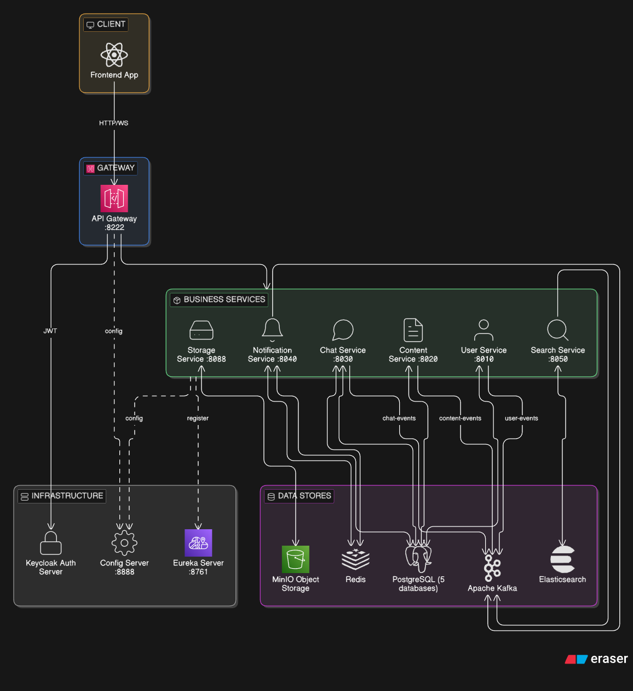
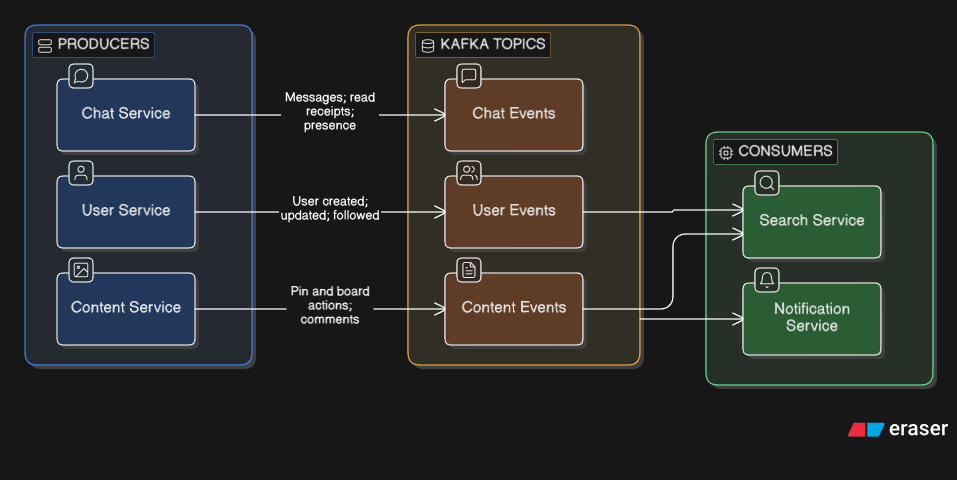
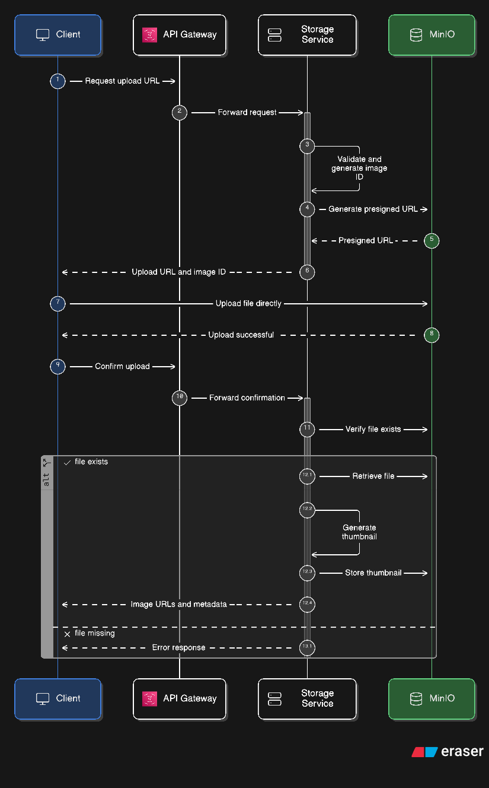
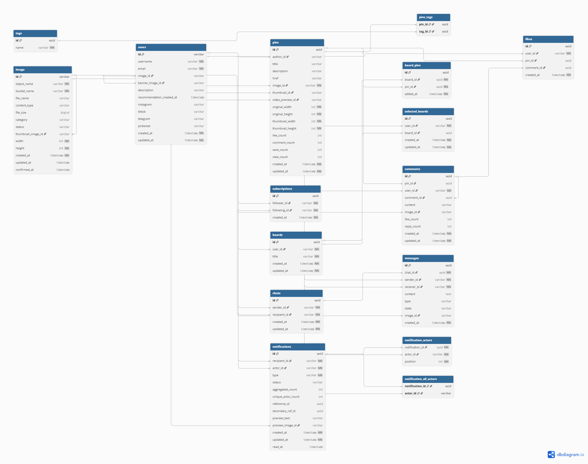

# 🎨 Pictorium

**Pictorium** is a full-featured image sharing platform inspired by Pinterest. Built on a microservices architecture using Spring Boot, Kafka, Elasticsearch, WebSocket, and Keycloak.

---

## 📋 Table of Contents

- [Project Overview](#-project-overview)
- [Architecture](#-architecture)
- [Tech Stack](#-tech-stack)
- [Microservices](#-microservices)
    - [API Gateway](#api-gateway)
    - [User Service](#user-service)
    - [Content Service](#content-service)
    - [Storage Service](#storage-service)
    - [Chat Service](#chat-service)
    - [Notification Service](#notification-service)
    - [Search Service](#search-service)
    - [Config Server](#config-server)
    - [Eureka Server](#eureka-server)
- [Database Schema](#-database-schema)
- [Kafka Event Flows](#-kafka-event-flows)
- [Getting Started](#-getting-started)
- [API Endpoints](#-api-endpoints)
- [Configuration](#-configuration)

---

## 🔍 Project Overview

Pictorium allows users to:

- 📌 **Create and share pins** — upload images with descriptions and tags
- 📋 **Organize collections** — save pins to themed boards
- ❤️ **Interact with content** — likes, comments, nested replies
- 💬 **Chat in real time** — private messaging via WebSocket
- 🔔 **Receive notifications** — SSE notifications with smart aggregation
- 🔍 **Search content** — full-text search with personalization and autocomplete
- 👥 **Follow authors** — subscription system with follower/following lists

---

## 🧩 Architecture

### High-Level Overview



### Service Communication



### Image Upload Flow



---

## 💻 Tech Stack

### Backend

| Technology                  | Purpose                              |
|:----------------------------|:-------------------------------------|
| Java                        | Primary language                     |
| Spring Boot                 | Application framework                |
| Spring Cloud Gateway        | API Gateway (WebFlux)                |
| Spring Cloud Config         | Centralized configuration            |
| Spring Cloud Netflix Eureka | Service discovery                    |
| Spring Security + OAuth2    | Authentication & authorization (JWT) |
| Spring Data JPA             | ORM / data access                    |
| Spring Data Elasticsearch   | Search integration                   |
| Spring WebSocket (STOMP)    | Real-time chat                       |
| Spring Kafka                | Asynchronous event streaming         |
| MapStruct                   | DTO mapping                          |
| Liquibase                   | Database migrations                  |
| OpenFeign                   | Inter-service HTTP calls             |
| Thumbnailator               | Image thumbnail generation           |

### Infrastructure

| Technology           | Purpose                           |
|:---------------------|:----------------------------------|
| PostgreSQL           | Primary database (5 databases)    |
| Elasticsearch        | Full-text search (7 indices)      |
| Apache Kafka (KRaft) | Event broker                      |
| Redis                | Cache, presence, counters         |
| MinIO                | S3-compatible object storage      |
| Keycloak             | Identity provider (OAuth2 / OIDC) |
| Docker & Compose     | Containerization                  |

---

## 🔧 Microservices

### API Gateway

**Port:** `8222`

Single entry point for all client requests.

- Routes traffic to all services via Eureka service discovery (`lb://SERVICE-NAME`)
- JWT validation through Keycloak (supports `Authorization: Bearer` header and `?token=` query param for WebSocket/SSE)
- CORS configuration
- Aggregated Swagger UI for all services
- Role extraction from `realm_access` and `resource_access` JWT claims
- Role-based access control (`/api/admin/**` → `ROLE_admin`)

---

### User Service

**Port:** `8010` &nbsp;|&nbsp; **DB:** `users_db` &nbsp;|&nbsp; **Kafka:** producer (`user-events`)

User profile management and subscription system.

**Key Features:**
- Automatic user synchronization from Keycloak JWT on every request (`UserSynchronizerFilter`) — creates new users on first login, updates email if changed
- Profile fields: username, description, avatar, banner, social links (Instagram, TikTok, Telegram, Pinterest)
- Subscriptions: follow/unfollow, isFollowing check, paginated followers/following lists
- Image management via Feign client to Storage Service

**Kafka Events:**
- `USER_CREATED` — on first user login
- `USER_UPDATED` — on profile update
- `USER_FOLLOWED` — on follow action

---

### Content Service

**Port:** `8020` &nbsp;|&nbsp; **DB:** `content_db` &nbsp;|&nbsp; **Kafka:** producer (`content-events`)

Core content service: pins, boards, comments, likes.

**Pins:**
- Full CRUD with image, thumbnail, and video preview support
- Tags (many-to-many, auto-created on first use)
- Denormalized counters: likes, comments, saves, views
- Flexible filtering via JPA Specifications (text search, tags, author, saved by, liked by, related, board, date range)
- Scopes: `ALL`, `CREATED`, `SAVED`, `LIKED`, `RELATED`
- Batch user interaction loading (`PinInteractionDto`: isLiked, lastSavedBoard info)

**Boards:**
- CRUD with unique constraint on (userId, title)
- Save pins to single or multiple boards
- Selected board tracking (`SelectedBoard`) — remembers last used board
- Board-pin status check (`BoardWithPinStatusResponse`)

**Comments:**
- Comments on pins with optional image attachment
- One level of nesting (replies)
- Denormalized counters: likes, replies
- Cascading delete with image cleanup via Storage Service

**Likes:**
- Likes on both pins and comments
- Unique constraints: (userId, pinId) and (userId, commentId)

**Categories:**
- Tag + pin preview for browsing categories
- Special "Everything" category

**Kafka Events:**
- `PIN_CREATED`, `PIN_UPDATED`, `PIN_DELETED`
- `PIN_LIKED`, `PIN_COMMENTED`, `PIN_SAVED`
- `COMMENT_LIKED`, `COMMENT_REPLIED`
- `BOARD_CREATED`, `BOARD_UPDATED`, `BOARD_DELETED`, `BOARD_PIN_ADDED`, `BOARD_PIN_REMOVED`

---

### Storage Service

**Port:** `8088` &nbsp;|&nbsp; **DB:** `storage_db` &nbsp;|&nbsp; **Object Storage:** MinIO

Image management using the presigned URL pattern.

**Upload Workflow:**
1. Client requests a presigned upload URL
2. Client uploads file directly to MinIO
3. Client confirms upload → service verifies the file and generates a thumbnail

**Features:**
- Presigned PUT/GET URLs with configurable TTL
- Automatic JPEG thumbnail generation (default: 236px width, 0.85 quality)
- Supported formats: JPEG, PNG, GIF, WebP
- Image lifecycle: `PENDING` → `CONFIRMED` → `DELETED` / `EXPIRED`
- Cleanup scheduler — removes `PENDING` records older than 2 hours (including MinIO objects)
- Two buckets: `images` (originals) and `thumbnails` (generated thumbnails)
- File size limit: 10 MB

---

### Chat Service

**Port:** `8030` &nbsp;|&nbsp; **DB:** `chat_db` &nbsp;|&nbsp; **Kafka:** producer (`chat-events`) &nbsp;|&nbsp; **Redis** &nbsp;|&nbsp; **WebSocket (STOMP)**

Real-time private messaging between users.

**WebSocket Protocol:**

| Type                                  | Direction       | Description                |
|:--------------------------------------|:----------------|:---------------------------|
| `SEND_MESSAGE`                        | Client → Server | Send a message             |
| `TYPING_START` / `TYPING_STOP`        | Client → Server | Typing indicator           |
| `MARK_READ`                           | Client → Server | Mark messages as read      |
| `JOIN_CHAT` / `LEAVE_CHAT`            | Client → Server | Enter/leave a chat room    |
| `HEARTBEAT`                           | Client → Server | Keep-alive ping            |
| `NEW_MESSAGE`                         | Server → Client | New incoming message       |
| `USER_TYPING` / `USER_STOPPED_TYPING` | Server → Client | Typing indicator broadcast |
| `MESSAGES_READ`                       | Server → Client | Read receipt               |
| `USER_ONLINE` / `USER_OFFLINE`        | Server → Client | Presence status change     |

**Presence System (Redis):**
- Online status with TTL (60 seconds)
- Last seen timestamp stored for up to 30 days
- Active chat tracking (which chat a user has open)
- Typing indicators with auto-expiry (3 seconds)
- Computed statuses: `ONLINE`, `RECENTLY`, `LAST_HOUR`, `TODAY`, `YESTERDAY`, `WEEK`, `LONG_AGO`

**Message Types:** `TEXT`, `IMAGE`, `VIDEO`, `AUDIO`, `FILE`

**Smart Delivery:** `NEW_MESSAGE` Kafka event is published only if the recipient is not currently viewing the chat.

---

### Notification Service

**Port:** `8040` &nbsp;|&nbsp; **DB:** `notification_db` &nbsp;|&nbsp; **Kafka:** consumer &nbsp;|&nbsp; **Redis** &nbsp;|&nbsp; **SSE**

Notification system with Pinterest-style aggregation.

**Notification Aggregation:**
```
"Alice, Bob, and 5 others liked your pin"
```

- **Single-action types** (`PIN_LIKED`, `PIN_SAVED`, `COMMENT_LIKED`, `USER_FOLLOWED`) — one action per user, deduplicated via `allActorIds` set
- **Repeatable types** (`NEW_MESSAGE`, `PIN_COMMENTED`, `COMMENT_REPLIED`) — multiple actions from the same user are allowed
- `recentActorIds` (up to 3) — for displaying avatar previews
- `allActorIds` (Set) — for deduplication
- `aggregatedCount` / `uniqueActorCount` — for display text

**SSE (Server-Sent Events):**
- Persistent connection with heartbeat every 30 seconds
- JWT authentication via query parameter (`?token=`) for browser EventSource API compatibility
- Event types: `notification`, `notification_updated`, `unread_update`, `heartbeat`, `connected`

**Redis:** cached unread notification counter

**Kafka Consumers:**
- `chat-events` → `NEW_MESSAGE`
- `content-events` → `PIN_LIKED`, `PIN_COMMENTED`, `PIN_SAVED`, `COMMENT_LIKED`, `COMMENT_REPLIED`
- `user-events` → `USER_FOLLOWED`

**Cleanup:** notifications older than 30 days are deleted daily at 3:00 AM.

---

### Search Service

**Port:** `8050` &nbsp;|&nbsp; **Elasticsearch** &nbsp;|&nbsp; **Kafka:** consumer

Full-text search with personalization, analytics, and autocomplete.

**Elasticsearch Indices (7):**

| Index              | Purpose                  | Shards |
|:-------------------|:-------------------------|:------:|
| `pins`             | Pin search               |   3    |
| `users`            | User search              |   2    |
| `boards`           | Board search             |   2    |
| `search_analytics` | Query logging            |  auto  |
| `search_history`   | Per-user search history  |  auto  |
| `trending_queries` | Trending queries         |  auto  |
| `user_interests`   | Personalization profiles |  auto  |

**Search Features:**
- Multi-match across title, description, tags, username with field boosting
- Fuzzy search (auto-corrects typos)
- Highlighting (matching fragments in results)
- Filters: tags, authorId, date range
- Sorting: `RELEVANCE`, `RECENT`, `POPULAR`, `LIKES`, `SAVES`
- More Like This — find similar pins based on content

**Personalization:**
- `UserInterestDocument` — tagWeights, likedAuthors, followedAuthors
- Action weights: LIKE = 1.0, SAVE = 2.0, VIEW = 0.1
- Temporal decay factor of 0.95 on each update
- Elasticsearch `FunctionScoreQuery` with boosts: followed author ×3.0, tag boost up to ×2.0

**Autocomplete (Suggest):**
- Edge n-gram analyzer (2–20 characters)
- Three suggestion types: `PIN_TITLE`, `TAG`, `USERNAME`
- Prefix queries with deduplication

**Custom Elasticsearch Analyzers:**
- `autocomplete` — edge_ngram tokenizer for type-ahead
- `russian_analyzer` — Russian stop words + stemmer
- `russian_search` — Russian analyzer + synonyms (фото↔фотография↔снимок, etc.)

**Analytics:**
- Async logging of every search query
- Trending score formula: `count × log(uniqueUsers + 1) × 2` (recalculated hourly)
- Analytics cleanup for records older than 30 days

**Kafka Consumer Groups:**
- `search-service` — indexes pins, boards, and users
- `search-service-personalization` — updates user interest profiles

---

### Config Server

**Port:** `8888`

Spring Cloud Config Server with native profile. Stores configurations for all services in classpath resources.

---

### Eureka Server

**Port:** `8761`

Netflix Eureka Server for service discovery. All services register automatically on startup.

---

## 📊 Database Schema



---

## 📨 Kafka Event Flows

### Topics

| Topic            | Partitions | Producers       | Consumers                            |
|:-----------------|:----------:|:----------------|:-------------------------------------|
| `user-events`    |     3      | User Service    | Notification Service, Search Service |
| `content-events` |     3      | Content Service | Notification Service, Search Service |
| `chat-events`    |     3      | Chat Service    | Notification Service                 |

### Event Routing

```
user-events:
  ├── USER_CREATED       → Search (index user)
  ├── USER_UPDATED       → Search (update user index)
  ├── USER_DELETED       → Search (delete from index)
  └── USER_FOLLOWED      → Notification (notify recipient)
                          → Search (personalization + update counters)

content-events:
  ├── PIN_CREATED        → Search (index pin)
  ├── PIN_UPDATED        → Search (update pin index)
  ├── PIN_DELETED        → Search (delete from index)
  ├── PIN_LIKED          → Notification (notify pin author)
  │                      → Search (update counters + personalization)
  ├── PIN_COMMENTED      → Notification (notify pin author)
  ├── PIN_SAVED          → Search (personalization)
  ├── COMMENT_LIKED      → Notification (notify comment author)
  ├── COMMENT_REPLIED    → Notification (notify parent comment author)
  ├── BOARD_CREATED      → Search (index board)
  ├── BOARD_UPDATED      → Search (update board index)
  ├── BOARD_DELETED      → Search (delete from index)
  ├── BOARD_PIN_ADDED    → Search (update board pin count)
  └── BOARD_PIN_REMOVED  → Search (update board pin count)

chat-events:
  ├── NEW_MESSAGE        → Notification (notify if recipient not in chat)
  ├── MESSAGES_READ      → (internal to chat service)
  ├── USER_ONLINE        → (broadcast via WebSocket)
  └── USER_OFFLINE       → (broadcast via WebSocket)
```

---

## 🚀 Getting Started

### Prerequisites

- Docker & Docker Compose
- Java 21 (for local development)
- Make (optional, but recommended)

### Quick Start

```bash
cd deployment

# 1. Start infrastructure (PostgreSQL, Kafka, Redis, Elasticsearch, MinIO, Keycloak)
make infra-up

# 2. Wait for all services to become healthy (especially Keycloak and Elasticsearch)
make health

# 3. Start application services
make services-up

# Or start everything at once in dev mode:
make dev-up
```

### Keycloak Setup

After starting, Keycloak is available at `http://localhost:9090`:

1. Log in with `admin` / `admin`
2. Create a realm named `pictorium`
3. Create a client for the frontend application
4. Configure roles and users as needed

### Useful Commands

```bash
# Check health of all services
make health

# View logs for a specific service
make services-logs-service SERVICE=content-service

# Connect to databases
make db-shell-content
make db-shell-users

# Redis CLI
make redis-cli

# List Kafka topics
make kafka-topics

# Elasticsearch status
make es-health
make es-indices

# Rebuild a single service
make build SERVICE=user-service

# Stop everything
make dev-down

# Stop and remove all volumes (full reset)
make infra-down-v
```

### Service URLs

| Service                 | URL                                   |
|:------------------------|:--------------------------------------|
| API Gateway             | http://localhost:8222                 |
| Swagger UI (aggregated) | http://localhost:8222/swagger-ui.html |
| Eureka Dashboard        | http://localhost:8761                 |
| Keycloak Admin          | http://localhost:9090                 |
| MinIO Console           | http://localhost:9001                 |
| Elasticsearch           | http://localhost:9200                 |
| Config Server           | http://localhost:8888                 |

---

## 📡 API Endpoints

### User Service

```
GET    /api/v1/users/me                          # Current authenticated user
GET    /api/v1/users/user/id/{userId}             # Get user by ID
GET    /api/v1/users/user/username/{username}     # Get user by username
PATCH  /api/v1/users/me                           # Update current user profile

POST   /api/v1/subscriptions/users/{userId}       # Follow a user
DELETE /api/v1/subscriptions/users/{userId}       # Unfollow a user
GET    /api/v1/subscriptions/check/{userId}       # Check if following
GET    /api/v1/subscriptions/followers/{userId}   # Get user's followers
GET    /api/v1/subscriptions/following/{userId}   # Get user's following
```

### Content Service

```
# Pins
GET    /api/v1/pins                               # Search/filter pins
GET    /api/v1/pins/{pinId}                        # Get pin by ID
POST   /api/v1/pins                                # Create a pin
PATCH  /api/v1/pins/{pinId}                        # Update a pin
DELETE /api/v1/pins/{pinId}                        # Delete a pin

# Boards
GET    /api/v1/boards/me                           # Current user's boards
GET    /api/v1/boards/user/{userId}                # User's boards
GET    /api/v1/boards/{boardId}                    # Get board by ID
POST   /api/v1/boards                              # Create a board
PATCH  /api/v1/boards/{boardId}                    # Update a board
DELETE /api/v1/boards/{boardId}                    # Delete a board
POST   /api/v1/boards/{boardId}/pins/{pinId}      # Save pin to board
DELETE /api/v1/boards/{boardId}/pins/{pinId}      # Remove pin from board
GET    /api/v1/boards/{boardId}/pins               # Get pins in a board
POST   /api/v1/boards/pins/{pinId}                 # Save pin to multiple boards
POST   /api/v1/boards/with-pin/{pinId}             # Create board and save pin
GET    /api/v1/boards/me/for-pin/{pinId}           # Boards with pin save status
PATCH  /api/v1/boards/{boardId}/select             # Select active board
GET    /api/v1/boards/selected                     # Get selected board
DELETE /api/v1/boards/selected                     # Clear selected board

# Comments
POST   /api/v1/pins/{pinId}/comments               # Comment on a pin
GET    /api/v1/pins/{pinId}/comments               # Get pin comments
GET    /api/v1/comments/{commentId}                # Get comment by ID
PATCH  /api/v1/comments/{commentId}                # Update comment
DELETE /api/v1/comments/{commentId}                # Delete comment
POST   /api/v1/comments/{commentId}/replies        # Reply to a comment
GET    /api/v1/comments/{commentId}/replies        # Get replies

# Likes
POST   /api/v1/pins/{pinId}/likes                  # Like a pin
DELETE /api/v1/pins/{pinId}/likes                  # Unlike a pin
GET    /api/v1/pins/{pinId}/likes                  # Get pin likes
POST   /api/v1/comments/{commentId}/likes          # Like a comment
DELETE /api/v1/comments/{commentId}/likes          # Unlike a comment
GET    /api/v1/comments/{commentId}/likes          # Get comment likes

# Tags
GET    /api/v1/tags                                # All tags (paginated)
GET    /api/v1/tags/{tagId}                        # Get tag by ID
GET    /api/v1/tags/pins/{pinId}                   # Get tags for a pin
GET    /api/v1/tags/search?q=...                   # Search tags
GET    /api/v1/tags/categories                     # Get categories
```

### Chat Service

```
# Chats
POST   /api/v1/chats/with/{recipientId}            # Get or create chat
GET    /api/v1/chats                                # List my chats
GET    /api/v1/chats/{chatId}                       # Get chat by ID
DELETE /api/v1/chats/{chatId}                       # Delete chat

# Messages
GET    /api/v1/chats/{chatId}/messages              # Get messages (paginated)
GET    /api/v1/chats/{chatId}/messages/all          # Get all messages
PATCH  /api/v1/chats/{chatId}/messages/read         # Mark as read
GET    /api/v1/chats/{chatId}/messages/unread/count # Unread count

# Presence
GET    /api/v1/presence?userIds=...                 # Batch presence data
GET    /api/v1/presence/{userId}                    # Single user presence
GET    /api/v1/presence/{userId}/online             # Online status check

# WebSocket
WS     /ws/chat                                     # STOMP WebSocket endpoint
```

### Storage Service

```
POST   /api/v1/images/presigned-upload              # Get presigned upload URL
POST   /api/v1/images/confirm                       # Confirm upload
GET    /api/v1/images/{imageId}                     # Download image
GET    /api/v1/images/{imageId}/url                 # Get presigned download URL
GET    /api/v1/images/{imageId}/metadata            # Get image metadata
DELETE /api/v1/images/{imageId}                     # Delete image
GET    /api/v1/images/list?category=...             # List images by category
```

### Notification Service

```
GET    /api/v1/notifications                        # All notifications (paginated)
GET    /api/v1/notifications/unread                 # Unread notifications
GET    /api/v1/notifications/unread/count           # Unread count
PATCH  /api/v1/notifications/read-all               # Mark all as read
PATCH  /api/v1/notifications/read                   # Mark selected as read
DELETE /api/v1/notifications/{id}                   # Delete notification

# SSE
GET    /api/v1/sse/connect                          # SSE connection (text/event-stream)
```

### Search Service

```
GET    /api/v1/search?q=...                         # Universal search (pins + users + boards)
GET    /api/v1/search/pins?q=...                    # Search pins
POST   /api/v1/search/pins                          # Search pins (POST with body)
GET    /api/v1/search/pins/{pinId}/similar          # Find similar pins
GET    /api/v1/search/users?q=...                   # Search users
GET    /api/v1/search/boards?q=...                  # Search boards
GET    /api/v1/search/suggest?q=...                 # Autocomplete suggestions
GET    /api/v1/search/trending                      # Trending queries
GET    /api/v1/search/history                       # User search history
DELETE /api/v1/search/history                       # Clear search history
```

---

## ⚙️ Configuration

All service configurations are managed centrally via **Config Server** and stored in:
```
config-server/src/main/resources/configurations/
```

### Environment Variables

| Variable                  | Default                                  | Description               |
|:--------------------------|:-----------------------------------------|:--------------------------|
| `KEYCLOAK_ISSUER_URI`     | `http://localhost:9090/realms/pictorium` | Keycloak realm issuer URI |
| `KAFKA_BOOTSTRAP_SERVERS` | `localhost:9092`                         | Kafka broker address      |
| `REDIS_HOST`              | `localhost`                              | Redis host                |
| `REDIS_PORT`              | `6379`                                   | Redis port                |
| `MINIO_ENDPOINT`          | `http://localhost:9000`                  | MinIO API endpoint        |
| `MINIO_ACCESS_KEY`        | `admin`                                  | MinIO access key          |
| `MINIO_SECRET_KEY`        | `minioadmin123`                          | MinIO secret key          |
| `ELASTICSEARCH_URI`       | `http://localhost:9200`                  | Elasticsearch cluster URI |

### Databases

| Database          | User                | Password          | Service              |
|:------------------|:--------------------|:------------------|:---------------------|
| `users_db`        | `user_service`      | `user123`         | User Service         |
| `content_db`      | `content_user`      | `content123`      | Content Service      |
| `storage_db`      | `storage_user`      | `storage123`      | Storage Service      |
| `chat_db`         | `chat_user`         | `chat123`         | Chat Service         |
| `notification_db` | `notification_user` | `notification123` | Notification Service |